# NETRT In-Depth Details

This document provides a detailed look into the architecture, workflow, and components of the NETRT application.

## Application Workflow

The NETRT service operates in a continuous loop, processing DICOM studies as they are received. The workflow can be broken down into the following key stages:

1.  **Reception**: A DICOM C-STORE SCP (listener) waits for an external system (like a PACS or another node) to send a DICOM study. As files are received, they are saved into a temporary directory structure organized by `StudyInstanceUID`.

2.  **Detection**: A file system watcher (`watchdog`) monitors the working directory. When it detects that files have stopped arriving for a specific study (after a configurable debounce interval), it triggers the processing pipeline for that study.

3.  **Processing**: The core logic is executed on the completed study directory:
    a.  The application identifies the main CT image series and the corresponding RT Structure Set file.
    b.  It reads the contour data from the RTSTRUCT file.
    c.  Specified contours (e.g., "skull") are ignored, and the remaining contours are merged into a single 3D binary mask.
    d.  A new DICOM series is created based on the original CT images.
    e.  The binary mask is embedded into the overlay plane (group 0x6000) of each slice in the new series.
    f.  (Optional) A text disclaimer is burned into the pixel data.
    g.  (Optional) The new series undergoes DICOM anonymization based on rules in `config.yaml`.

4.  **Transmission**: The newly generated DICOM series (with overlays) is sent to the configured DICOM destination using C-STORE SCU operations.

5.  **Cleanup**: After successful transmission, the temporary directory for the processed study is deleted. If any stage of processing or sending fails, the study is moved to a `quarantine` directory for manual inspection.

## Data Flow Diagram

The following diagram illustrates the flow of a DICOM study through the NETRT application.

```graphviz
digraph NETRT_Workflow {
    rankdir=LR;
    node [shape=box, style=rounded];

    subgraph cluster_external {
        label = "External System (PACS)";
        style=filled;
        color=lightgrey;
        PACS [label="DICOM Source"];
    }

    subgraph cluster_netrt {
        label = "NETRT Application";

        subgraph cluster_reception {
            label = "1. Reception";
            DicomListener [label="DICOM Listener\n(C-STORE SCP)"];
            WorkingDir [label="Working Directory\n(UID_.../)", shape=folder];
        }

        subgraph cluster_detection {
            label = "2. Detection";
            Watcher [label="File System Watcher\n(debounce)"];
        }

        subgraph cluster_processing {
            label = "3. Processing";
            StudyProcessor [label="Study Processor"];
            ContourProcessing [label="Contour & Overlay Logic"];
            Anonymizer [label="Anonymizer"];
        }

        subgraph cluster_sending {
            label = "4. Transmission";
            DicomSender [label="DICOM Sender\n(C-STORE SCU)"];
        }

        DicomListener -> WorkingDir [label="Saves files"];
        Watcher -> StudyProcessor [label="Triggers on completion"];
        StudyProcessor -> ContourProcessing [label="Generates overlay series"];
        ContourProcessing -> Anonymizer [label="Anonymizes data"];
        Anonymizer -> DicomSender [label="Sends processed series"];
        
        StudyProcessor -> QuarantineDir [style=dashed, color=red, label="On Failure"];
        DicomSender -> Cleanup [style=dashed, color=blue, label="On Success"];
    }

    subgraph cluster_destination {
        label = "External System (Destination)";
        style=filled;
        color=lightgrey;
        Destination [label="DICOM Destination"];
    }
    
    QuarantineDir [label="Quarantine Directory", shape=folder, color=red];
    Cleanup [label="Cleanup\n(Delete Dir)", shape=ellipse, color=blue];

    PACS -> DicomListener [label="C-STORE Push"];
    DicomSender -> Destination [label="C-STORE Push"];
}
```

## Core Components

-   **`main.py`**: The main entry point that initializes and starts all other components.
-   **`netrt_core/`**: A Python package containing the modernized, core logic of the application.
    -   **`dicom_listener.py`**: Manages the pynetdicom server for receiving files.
    -   **`file_system_manager.py`**: Handles all file and directory operations, including creating study directories, saving files, and managing the `watchdog` observer.
    -   **`study_processor.py`**: Orchestrates the main processing pipeline for a study after it has been received.
    -   **`config_loader.py`**: Loads and validates the `config.yaml` file.
    -   **`logging_setup.py`**: Configures the application and transaction loggers.
-   **Legacy Scripts**: A number of scripts (`Contour_Addition.py`, `DicomAnonymizer.py`, `Send_Files.py`, etc.) contain the original processing logic. These are currently called by the `StudyProcessor` and are targeted for refactoring into the `netrt_core` package.

